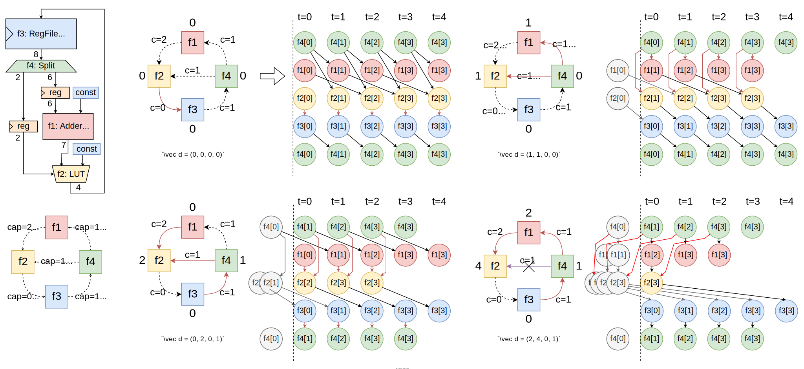

# Khronos

Khronos is moving to [https://github.com/pku-liang](https://github.com/pku-liang).

## Introductions

Khronos is a cycle-accurate software RTL simulation tool that exploits the temporal data (hardware state) locality between consecutive cycles. Khronos will fuse state writes and reads with temporal localities, effectively reducing the pressure to the host cache and memory. 



As shown in the figure, the queue graph captures temporal data dependencies and enables temporal optimization between cycles. By adjust the simulation order and re-schedule the simulation, Khronos can reducing the memory access and accelerate RTL simulation.

## Installation

Setup depedencies:

```bash
mkdir install
export INSTALL_PREFIX=$PWD/install
git submodule update --init
cd third_party
./setup-circt.sh
./setup-lemon.sh
```

Build khronos:

```bash
mkdir build && cd build
cmake .. -DCMAKE_INSTALL_PREFIX=$INSTALL_PREFIX -DCMAKE_BUILD_TYPE=Release
make ksim
make install
```

## Usage

Currently, Khronos has full support for firtool frontend, partly support for moore and calyx frontend.

```bash
# add current install prefix to path
export PATH=$PWD/install/bin:$PATH

# first, translate firrtl file to mlir dialect
firtool --ir-hw --disable-all-randomization $design.fir -o $design.mlir

# then, translate mlir to llvm ir
#   generating header and default implementation
ksim $design.mlir -v -o $design.ll --out-header=$design.h --out-driver=$design.cpp

# call LLVM to compile the llvm ir file to binary
llc --relocation-model=dynamic-no-pic -O2 -filetype=obj $design.ll -o $design.o

# link testbench and simulator together
clang++ -O2 $design.o $design.cpp -o $design
```

## Citing Khronos

If you use this software, please cite it as below.

```bibtex
@inproceedings{Khronos,
  author = {Kexing, Zhou and Yun, Liang and Yibo, Lin and Runsheng, Wang and Ru, Huang},
  title = {Khronos: Fusing Memory Access for Improved Hardware RTL Simulation},
  booktitle = {MICRO '23: 55th IEEE/ACM International Symposium on Microarchitecture},
  publisher = {ACM},
  year = {2023},
  url = {https://doi.org/10.1145/3613424.3614301},
  doi = {10.1145/3613424.3614301}
}
```
